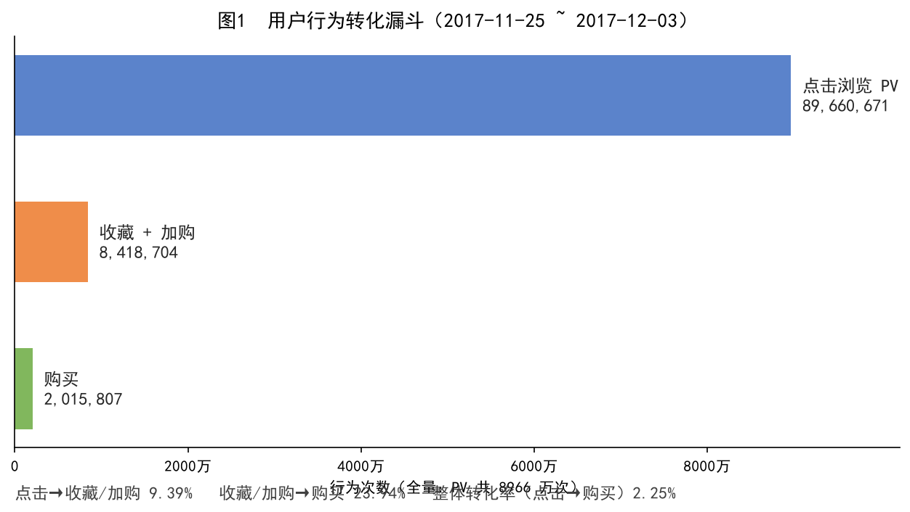
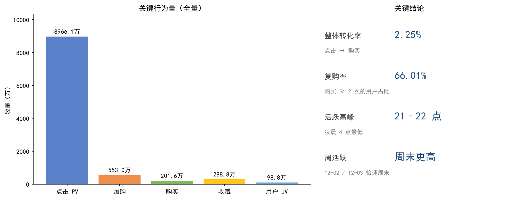

# 淘宝用户行为数据分析（Hive 批处理）

基于天池「淘宝用户行为数据集」的大数据离线分析项目。使用 Hive SQL 完成从建表、数据加载、清洗到六大业务分析的完整链路，对约 **1 亿条**用户行为记录做流量、转化、习惯、用户价值与商品维度的分析，全部结论可在本机 Docker Hive 环境中复现。

## 数据集

- 来源：[天池 · 淘宝用户行为数据集](https://tianchi.aliyun.com/dataset/649)
- 规模：100,150,807 条（约 1 亿条），原始 CSV 约 3.67 GB
- 时间范围：2017-11-25 ~ 2017-12-03
- 字段：`user_id`（用户ID）、`item_id`（商品ID）、`category_id`（商品类目ID）、`behavior_type`（行为类型：pv / buy / cart / fav）、`timestamp`（行为时间戳）

> 注意：原始数据文件（约 3.67GB）超过 GitHub 单文件 100MB 上限，**未包含在本仓库中**，已通过 `.gitignore` 排除。复现请先前往天池下载 `UserBehavior.csv`。

## 技术栈

Hive / HiveQL · Hadoop 离线批处理 · 数据清洗 · 窗口函数（`DENSE_RANK` / `NTILE`）· RFM 用户价值模型

## 项目结构

| 文件 | 说明 |
| --- | --- |
| `table.hql` | 建表、数据加载、数据清洗（全字段去重、时间戳格式化、异常时间与行为枚举过滤） |
| `analyse.hql` | 六大分析 SQL：流量与购物 / 转化漏斗 / 行为习惯 / RFM 用户价值 / 商品与类目排行 |
| `用户行为数据分析.md` | 原始分析报告：SQL、可视化与业务结论 |
| `可视化/` | 分析结果图表（转化漏斗、核心指标总览）与绘图脚本 `draw_analysis.py` |
| `UserBehavior.csv` | 原始数据（已被 `.gitignore` 排除，不参与提交） |

## 快速复现

1. 启动本机 Hive 环境（WSL Docker 中的 HiveServer2）
2. 建议先用 **500 万条抽样**跑通全流程（全程约 10 分钟），再跑全量复现原文数字（全程 1~2 小时）
3. 执行顺序：建表（`table.hql`）→ 加载数据 → 清洗 → 六大分析（`analyse.hql`）

## 核心结论（全量数据）

- 总 PV：**89,660,671**；总 UV：**987,991**；购买数：**2,015,807**
- 整体转化率（点击 → 购买）：**2.25%**（电商大促前转化率偏低，推断与节前蓄水、等待活动有关）
- 复购率：**66.01%**，用户忠诚度较高
- 活跃时段：**21–22 点为一天高峰**，凌晨 4 点最低
- 周活跃：**周末活跃度明显高于工作日**（12-02、12-03 恰逢周末）

## 分析结果可视化

基于全量分析结果绘制的图表（绘图脚本：`可视化/draw_analysis.py`，数据来源：`用户行为数据分析.md`）：

> 日均流量、24 小时活跃分布等趋势图依赖 Hive 查询结果的导出数据，暂未包含；如需补充，可在脚本中加载对应 CSV 后生成。

## 许可与数据版权

仓库内代码仅供学习交流使用。数据集版权归原始发布方所有，请遵守天池平台的使用条款，勿用于商业用途。
